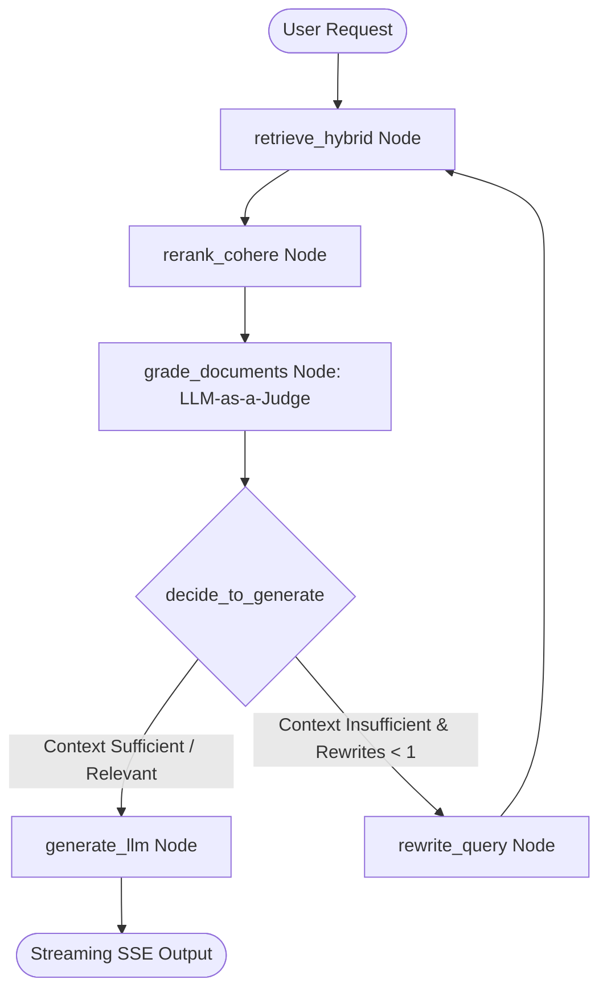

# 🏛️ Architectural Specification: Enterprise Multi-Tenant Agentic RAG Platform

> **Document Version:** 2.3
> **Target Audience:** Enterprise Solutions Architects, Staff AI Engineers, Security Reviewers, and Site Reliability Engineers (SREs).

---

## 1. System Topology & Request Path

The platform utilizes a modular service topology composed of an API Gateway, an Agentic State Machine, a Vector Database, a Redis cache and job queue, a relational state store, and an Operator Interface. Docker Compose and the root Dockerfile are the supported deployment paths; `render.yaml` provides a declarative Render web-service configuration.

```text
+───────────────────────────────────────────────────────────────────────────────────────────+
|                                    OPERATOR / CLIENT                                      |
|                                                                                           |
|           Streamlit Dashboard (Port 8501)  /  Third-Party Enterprise API Clients           |
+─────────────────────────────────────────────┬─────────────────────────────────────────────+
                                              │ (HTTPS / Bearer JWT)
                                              ▼
+───────────────────────────────────────────────────────────────────────────────────────────+
|                               FASTAPI API GATEWAY (Port 8000)                             |
|                                                                                           |
|  [Security Headers Middleware]   [Distributed Request ID]    [Rate Limiter (Fixed Window)]|
|                                                                                           |
|  [JWT / OIDC Authenticator] ──► Extracts: tenant_id, user_id, role                        |
|                                                                                           |
|  [NVIDIA NeMo Guardrails]   ──► Input Colang Rails & OWASP LLM01 Jailbreak Interception   |
|                                                                                           |
|  [Presidio PII Sanitizer]   ──► In-Memory Masking (Emails, SSNs, Phones, Cards, Secrets)  |
+──────────────────────────┬─────────────────────────────┬──────────────────────────────────+
                           │                             │
        (Cache Lookup)     │                             │ (Telemetry Spans)
        ▼                  ▼                             ▼
+─────────────────────────────+                +────────────────────────────────────────────+
|   REDIS IN-MEMORY STORE     |                |        DISTRIBUTED TRACING TRACKER         |
|                             |                |                                            |
| • Versioned Response Cache  |                | • Span Timers: retrieve_hybrid,            |
| • Dynamic Tenant Epochs     |                |   rerank_cohere, grade_documents,          |
| • Fixed-Window Rate Limits  |                |   rewrite_query, generate_llm              |
| • Async Ingestion Tracking  |                | • REST Telemetry API + Langfuse Cloud Sync |
+─────────────────────────────+                +────────────────────────────────────────────+
                           │ (Cache Miss)
                           ▼
+───────────────────────────────────────────────────────────────────────────────────────────+
|                         LANGGRAPH CORRECTIVE AGENTIC RAG ENGINE                           |
|                                                                                           |
|       +───────────────────────────────────────────────────────────────────────────+       |
|       |                           retrieve_hybrid Node                            |       |
|       |                                                                           |       |
|       |   Query ──► [Dense Embedder (BGE 384d)] + [Sparse Tokenizer (BM25)]       |       |
|       +─────────────────────────────────────┬─────────────────────────────────────+       |
|                                             │                                             |
|                                             ▼                                             |
|       +───────────────────────────────────────────────────────────────────────────+       |
|       |                     rerank_cohere Node (Cross-Encoder)                    |       |
|       |                                                                           |       |
|       |   Top Candidate Chunks ──► [Cohere Rerank API (v3.5)] ──► Scored Re-order |       |
|       +─────────────────────────────────────┬─────────────────────────────────────+       |
|                                             │                                             |
|                                             ▼                                             |
|       +───────────────────────────────────────────────────────────────────────────+       |
|       |                      grade_documents Node (LLM-as-a-Judge)                |       |
|       |                                                                           |       |
|       |   Binary Relevance Classification ('yes' / 'no' via LLM evaluator)        |       |
|       +─────────────────────────────────────┬─────────────────────────────────────+       |
|                                             │                                             |
|                                             ▼                                             |
|       +───────────────────────────────────────────────────────────────────────────+       |
|       |                         decide_to_generate Router                         |       |
|       +──────────────────┬────────────────────────────────────────┬───────────────+       |
|                          │ (Insufficient & Rewrite Count < 1)     │ (Relevant)    |
|                          ▼                                        ▼               |
|       +──────────────────────────────────────+  +─────────────────────────────────+       |
|       |          rewrite_query Node          |  |          generate_llm Node      |       |
|       |                                      |  |                                 |       |
|       |  Autonomous LLM Query Expansion ────►|  |  Grounded Synthesis (Groq Cloud)|       |
|       +──────────────────────────────────────+  +─────────────────┬───────────────+       |
+───────────────────────────────────────────────────────────────────┼───────────────────────+
                                                                    │
                    ┌───────────────────────────────────────────────┴───────────────────────┐
                    ▼                                                                       ▼
+─────────────────────────────────────────────+       +─────────────────────────────────────────────+
|           QDRANT VECTOR DATABASE            |       |             POSTGRESQL DATABASE             |
|                                             |       |                                             |
| • Dual Vector: dense (Cosine) + sparse      |       | • Composite Tenant Users (tenant_id, user)  |
| • Reciprocal Rank Fusion (RRF)              |       | • LangGraph Checkpoints (AsyncPostgresSaver)|
| • Payload Filter: tenant_id + allowed_roles |       | • Versioned Schema Migrations               |
+─────────────────────────────────────────────+       +─────────────────────────────────────────────+
```

---

## 2. Multi-Tenant Data & RBAC Isolation Model

Security in this platform is implemented via a multi-layered cryptographic and logical partitioning model:

```text
[ Authentication Layer ] ──► Token Claims: { sub: "alice", tenant_id: "corp_a", role: "analyst" }
                                      │
                                      ├──► [PostgreSQL] Queries restricted to WHERE tenant_id = 'corp_a'
                                      │
                                      ├──► [Qdrant] Filter: must = [ { tenant_id: 'corp_a' }, { allowed_roles: 'analyst' } ]
                                      │
                                      └──► [Redis] Cache Key: cache:SHA256(tenant_id || user || role || thread || epoch):SHA256(query)
```

### A. Database Isolation (PostgreSQL)
* Users are identified by the composite primary key:
  $$\text{Primary Key} = (\text{tenant\_id}, \text{username})$$
* Cross-tenant provisioning is strictly rejected at the route handler level with `HTTP 403 Forbidden` if a tenant administrator attempts to create a user outside their assigned `tenant_id`.
* Local authentication locks a tenant user after repeated failures, resets the counter after a successful login, checks `is_active` on every token request, and supports access-token revocation through Redis-backed logout. MFA and refresh-token endpoints are not implemented.

### B. Vector Database Isolation (Qdrant)
* Ingested document chunks are stored with metadata payloads:
  ```json
  {
    "text": "Extracted document chunk content...",
    "filename": "specification.pdf",
    "tenant_id": "corp_a",
    "allowed_roles": ["admin", "analyst"]
  }
  ```
* Every retrieval query constructs a mandatory `Filter`:
  ```python
  must=[
      FieldCondition(key="tenant_id", match=MatchValue(value=current_user.tenant_id)),
      FieldCondition(key="allowed_roles", match=MatchValue(value=current_user.role))
  ]
  ```
* Payload keyword indexes on both `tenant_id` and `allowed_roles` guarantee $O(\log N)$ filtered candidate lookups before distance computation.

### C. Cache Partitioning & Dynamic Version Epochs (Redis)
* Response cache keys use a two-tier cryptographic hash:
  $$\text{Scope Digest} = \text{SHA-256}(\text{tenant\_id} \mathbin{\Vert} \text{user\_id} \mathbin{\Vert} \text{role} \mathbin{\Vert} \text{thread\_id} \mathbin{\Vert} \text{version})$$
  $$\text{Query Digest} = \text{SHA-256}(\text{sanitized\_query})$$
  $$\text{Cache Key} = \text{cache}:\text{Scope Digest}:\text{Query Digest}$$
* **Tenant Version Invalidation:** When an administrator ingests or deletes a document, the system atomically increments the tenant version (`INCR tenant_ver:<tenant_id>`). This immediately invalidates all cached answers for that tenant without key-scan performance penalties or cross-tenant cache contamination.

---

## 3. Hybrid Retrieval & Cross-Encoder Reranking Engine

```text
User Query: "What is the hardware SKU in DOC ID #K8S-9921?"
    │
    ├──► FastEmbed Dense Embedder (BAAI/bge-small-en-v1.5) ──► 384-dimensional dense vector
    │
    └──► FastEmbed Sparse Tokenizer (Qdrant/bm25)           ──► Sparse token indices & frequencies
                                                                      │
                                                                      ▼
                     [ Qdrant Multi-Vector Parallel Prefetch (RBAC Filtered) ]
                                      │
                                      ├──► Prefetch 1: Top Dense Candidates (Cosine Distance)
                                      └──► Prefetch 2: Top Sparse Candidates (BM25 Term Weights)
                                                                      │
                                                                      ▼
                                          [ Reciprocal Rank Fusion (RRF) ]
                                                                      │
                                                                      ▼
                                           Top Candidates (e.g., Top 10 Chunks)
                                                                      │
                                                                      ▼
                                       [ Cohere Reranker API (rerank-v3.5) ]
                                  (Cross-Encoder Deep Semantic Relevance Scoring)
                                                                      │
                                                                      ▼
                                            Fused & Reranked Top-K Document Chunks
```

### Reciprocal Rank Fusion (RRF) Algorithm
To combine dense semantic vectors and sparse lexical tokens into a unified ranking without score distortion:

$$RRF\_Score(d) = \sum_{m \in \{dense, sparse\}} \frac{1}{k + rank_m(d)}$$

*(where $k = 60$ default smoothing constant).*

### Cohere Cross-Encoder Reranking
When `COHERE_API_KEY` is configured or `USE_COHERE_RERANK=true`, candidate chunks retrieved from Qdrant are passed through Cohere's `rerank-v3.5` cross-encoder model. The cross-encoder evaluates the complete query-document pair jointly, computing an authoritative `relevance_score` to prioritize the most contextually relevant chunks before passing them to the generation engine.

---

## 4. Corrective Agentic RAG (CRAG) State Graph

The workflow is compiled using LangGraph into an asynchronous Directed Acyclic Graph (DAG) with self-correcting conditional edges and **LLM-as-a-Judge** relevance grading:



### State Schema (`AgentState`)
| Field | Type | Description |
| :--- | :--- | :--- |
| `messages` | `Annotated[List[BaseMessage], operator.add]` | Stateful conversation history |
| `tenant_id` | `str` | Tenant identifier extracted from JWT |
| `user_role` | `str` | User access tier (`admin`, `analyst`, `viewer`) |
| `context` | `str` | Redacted context retrieved from knowledge base |
| `query` | `Optional[str]` | Active search query (original or reformulated) |
| `rewrite_count` | `int` | Loop guard counter (max 1 rewrite) |
| `is_relevant` | `bool` | LLM-as-a-Judge relevance decision |
| `available_documents`| `Optional[List[str]]` | Active document names in tenant scope |
| `trace_id` | `Optional[str]` | Unique distributed trace tracking identifier |

---

## 5. Defensive AI, NeMo Guardrails & Threat Modeling

The platform implements an end-to-end multi-layered defense pipeline against LLM vulnerabilities:

```text
[ Incoming Request ]
        │
        ▼
[ NVIDIA NeMo Guardrails: Input Rails & Colang Flows ]
        │ ──► Intercepts Jailbreaks, DAN Modes, System Prompt Overrides, Cross-Tenant Requests
        │ (Validated)
        ▼
[ Microsoft Presidio PII & Secrets Redaction Engine ]
        │ ──► Masks Emails, Phone Numbers, SSNs, Credit Cards, API Keys, JWT Tokens
        │ (Sanitized Payload)
        ▼
[ Hybrid RAG: Qdrant Search ──► Cohere Cross-Encoder Rerank ──► LLM Synthesis ]
        │ (Response Tokens)
        ▼
[ NVIDIA NeMo Guardrails: Output Rails & Redaction ]
        │ ──► Verifies Corporate Policy Compliance on Generated Text
        ▼
[ SSE Streaming Delivery to Client ]
```

| Threat Vector (OWASP LLM Top 10) | Mitigation Strategy | Architectural Location |
| :--- | :--- | :--- |
| **LLM01: Prompt Injection** | **NVIDIA NeMo Guardrails** (Colang input rails) + Regex pattern interception | `guardrails/rails.co` & `app/core/security.py` |
| **LLM02: Sensitive Info Disclosure** | **Microsoft Presidio** Analyzer/Anonymizer + Secrets scrubbing | `app/core/security.py` |
| **LLM06: Excessive Agency** | Bounded CRAG loop (`rewrite_count < 1`) + strict system prompts | `app/agents/graph.py` |
| **LLM08: Vector & Embedding Weaknesses** | Strict metadata payload filtering on `tenant_id` and `allowed_roles` | `app/db/qdrant.py` |
| **Infrastructure Privilege Escalation** | Multi-stage slim Docker container executing under non-root `USER appuser` | `Dockerfile` |

---

## 6. Distributed Observability & Telemetry

```text
[ API Gateway: Request Start ] ──► Initializes Trace: trace_id = request_id
                                           │
                                           ├──► Span 1: [retrieve_hybrid] (Dense BGE + Sparse BM25 Search)
                                           ├──► Span 2: [rerank_cohere]   (Cohere Cross-Encoder Reranking)
                                           ├──► Span 3: [grade_documents] (LLM-as-a-Judge Relevance Grading)
                                           ├──► Span 4: [rewrite_query]   (Optional LLM Query Reformulation)
                                           └──► Span 5: [generate_llm]     (Groq Cloud TTFT & Token Stream)
                                           │
[ API Gateway: Request End ]   ──► Finalizes Trace Record ──► Local Ring Buffer & Langfuse Ingestion API
```

* **Local In-Memory Tracker:** Retains a circular buffer of 500 traces for instant query via `/api/v1/telemetry/traces` and the Streamlit UI. Trace deletion is admin-only.
* **Langfuse Export:** When `LANGFUSE_PUBLIC_KEY` and `LANGFUSE_SECRET_KEY` are provided, the tracker asynchronously exports trace and span batches using Langfuse's REST API with tenant and role tagging.

---

## 7. Repository Structure & Operational Artifacts

```text
├── app/                    # FastAPI service, LangGraph workflow, storage, and security
├── frontend/               # Streamlit operator dashboard
├── scripts/                # Reproducible Ragas evaluation commands
├── scratch/                # Local-only document inspection utility
├── guardrails/             # NeMo Guardrails model and Colang configuration
├── tests/                  # Unit and regression tests
├── docs/screenshots/       # Optional architecture and UI screenshots
├── .github/workflows/      # CI quality gate and container delivery workflow
├── Dockerfile              # Multi-stage non-root application image
├── docker-compose.yml      # Supported local multi-service runtime
├── README.md               # Setup, deployment, evaluation, and portfolio overview
└── requirements.txt        # Version-constrained Python dependencies
```

The `scripts/` directory contains reproducible evaluation entry points. The
`scratch/` directory is intentionally separate from application code and is
not required at runtime.

---

## 8. Multi-Format Ingestion & Background Task Architecture

```text
[ Document Upload: PDF / DOCX / XLSX / CSV / HTML / Code ]
                             │
                             ├──► [Text Extraction & Structure Chunking]
                             │           │ (If Scanned / Image-Based PDF)
                             │           └──► [Pytesseract OCR Engine + Rasterizer]
                             │
                             ├──► [Presidio PII Redaction]
                             │
                             ├──► [Dual Embedding Generation: Dense BGE + Sparse BM25]
                             │
                             └──► [Qdrant Vector Upsert + PostgreSQL Record + Redis Cache Invalidation]
```

* **Synchronous Ingestion (`POST /api/v1/ingest`):** Best for standard documents (< 10 MB).
* **Asynchronous Ingestion (`POST /api/v1/ingest/async`):** Stores the payload in Redis and enqueues a job. A backend worker claims jobs with a lease, acknowledges success or failure, and requeues stale processing jobs after a crash.
* **Ingestion Status Polling (`GET /api/v1/ingest/status/{task_id}`):** Reports `status: "processing" | "completed" | "failed"` with chunk counts and error details.

### Operational limits and verified facts

| Dimension | Current value |
| :--- | :--- |
| Dense embedding size | 384 dimensions (`BAAI/bge-small-en-v1.5`) |
| Generation model | Groq Cloud `openai/gpt-oss-20b` |
| Default upload limit | 10 MiB |
| Maximum corrective rewrites | 1 |
| In-memory trace history | 500 traces |
| Local backend workers | 1, to avoid duplicate model memory |
| Local orchestration | Docker Compose with PostgreSQL, Redis, Qdrant, FastAPI, and Streamlit |

These are configuration and architecture values, not throughput guarantees. Latency and retrieval quality must be measured with the evaluation harness on the target hardware and provider configuration.

The primary generation path uses Groq Cloud with `openai/gpt-oss-20b`. NeMo Guardrails is enabled in the active environment and has its own self-check evaluator configured separately as `gpt-4o-mini`; that evaluator is used for guardrail checks, not answer generation. The NeMo model provider must be configured independently.

### Evaluation approach

`app/evaluation.py` uses Ragas for context precision and context recall, then reports measured mean and P95 latency alongside the quality scores. The smoke command in `scripts/evaluate_rag.py` uses three synthetic labeled cases and a Groq-backed LangChain evaluator. It verifies the measurement pipeline, not production retrieval quality. Langfuse complements Ragas by recording request-level traces and node latency for retrieval, reranking, grading, and generation.

### Latency decomposition

The platform intentionally accepts additional latency for stronger security, retrieval quality, tenant isolation, and observability. Each component is measured separately and the critical path is optimized from those measurements rather than by claiming an artificially low end-to-end number.

For a warm request with external reranking disabled, the portfolio reference is approximately **2.2 seconds average** from request validation through the first visible response:

| Layer | Expected range | Notes |
| :--- | ---: | :--- |
| Auth, validation, and Redis | ~0.05 s | Connection reuse and rate-limit lookup |
| Dense + sparse query embedding | ~0.35 s | Models execute concurrently |
| Filtered Qdrant RRF search | ~0.45 s | Includes the hosted vector-service round trip |
| Heuristic grading | ~0.01 s | LLM grading is optional and slower |
| Checkpoint and cache persistence | ~0.20 s | PostgreSQL and Redis connection health |
| Groq generation to first visible response | ~1.14 s | Prompt size, provider queue, and network |
| **Warm-path average** | **~2.20 s** | Excludes cold starts and optional Cohere reranking |

Cold starts, NeMo semantic checks, Cohere reranking, hosted database poolers, provider queueing, and long streamed completions can increase total request time. These values are a reference budget; Langfuse/telemetry spans are the source of truth for measurements on a particular deployment.

---

## 📸 Architectural Screenshot References

For architectural presentations and design reviews, screenshots should be referenced as follows:

1. **Dashboard & Streaming:** `docs/screenshots/01_dashboard_overview.png` *(Figure 1 in README.md)*
2. **Multi-Select RBAC Ingestion:** `docs/screenshots/02_rbac_ingestion.png` *(Figure 2 in README.md)*
3. **OWASP Injection Interception:** `docs/screenshots/03_injection_guardrail.png` *(Figure 3 in README.md)*
4. **Distributed Telemetry Spans:** `docs/screenshots/04_observability_traces.png` *(Figure 4 in README.md)*
